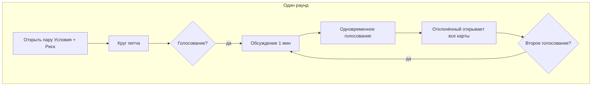

# Правила игры «Стартап и печеньки»

Дискуссионная карточная игра для **4–12 игроков**. Время партии: **45–90 минут**.

## Сюжет

Основатель безумного глобального проекта набирает **core team** — ограниченное число co-founder'ов и ключевых людей. Мест в команде хватит только на **половину** претендентов. В начале партии открывается **Питч** — нереалистичное приложение планетарного масштаба (телепорт еды, колонизация Марса, мессенджер с умершими, работа во сне). Каждый кандидат получает случайный набор IT-характеристик и должен убедить остальных, что именно он **лучше всего подходит под этот конкретный питч**, а не под «правильную должность».

## Цель игры

**Базовый режим:** попасть в core team стартапа после 5 раундов отбора.

**Режим «Запуск продукта»** (опционально): не только попасть в команду, но и доказать, что стартап переживёт риски и реализует питч.

## Состав игры

| Компонент | Количество |
|-----------|------------|
| Карты кандидата (6 категорий × колода) | см. `categories.md` |
| Карты Особых условий | 24 |
| Карты Питча | 12 |
| Карты условий работы (Ресурс) | 30 |
| Карты Риска | 24 |
| Бланки голосования | 12 |
| Таблица раундов | 1 (в правилах) |

## Подготовка к партии

1. Перемешайте колоды карт кандидата отдельно по категориям.
2. Раздайте **взакрытую** каждому игроку по **1 карте** из каждой из 6 категорий — всего **6 карт кандидата**.
3. Раздайте **взакрытую** каждому по **1 карте Особого условия**.
4. Откройте **1 случайную карту Питча**, положите в центр стола, прочитайте вслух.
5. Справа от Питча выложите **5 пар** (Условия работы + Риск) рубашкой вверх.
6. Раздайте бланки голосования и ручки.

Изучите свои карты, но **не показывайте** их другим. В ходе игры карты открываются постепенно перед вами на столе. Можно опираться на открытые карты и **блефовать** относительно закрытых.

> **Важно:** это игра. Вы играете за кандидата, а не за себя. Запрещено ссылаться на реальную должность, опыт или репутацию игрока вне игры. Эмоции остаются за столом.

## Ход игры

Игра проходит в **5 раундов**. Игрок, раздававший карты, становится первым активным игроком в раунде 1.

### Структура раунда

#### 1. Открытие контекста

Активный игрок открывает **одну пару** (Условия работы + Риск) и зачитывает вслух. Риск — кинематографичная угроза и удар по бизнесу; кандидаты аргументируют, чьи карты это закрывают.

#### 2. Круг питча

По кругу каждый **неотклонённый** игрок:

1. Открывает **1 карту кандидата** перед собой.
2. За **30 секунд** объясняет, почему он усиливает команду под текущий **Питч**, с учётом открытых **условий работы** и **рисков**.

**Правила открытия:**

| Раунд | Что открывается |
|-------|-----------------|
| 1 | Все обязаны открыть **Доменный бэкграунд** |
| 2–5 | Каждый сам выбирает, какую закрытую карту показать |

Одна карта кандидата у каждого игрока **остаётся закрытой** до финала.

Другие игроки могут коротко комментировать, не перебивая активного.

**Контекст решает знак карты:** любая открытая карта (кроме бэкграунда в раунде 1) может читаться в плюс или минус под текущий Питч, Условия и Риск. Если стол спорит — 30 секунд на решение: плюс / нейтрально / минус до конца раунда (подробнее в `cards/candidates.md`).

Отклонённые игроки **не открывают** карты и **не** становятся активными — ход переходит к следующему неотклонённому.

#### 3. Голосование

Проводится, если указано в **Таблице раундов** (см. ниже).

1. **Обсуждение (1 мин):** все игроки, включая отклонённых, предлагают кандидатов на отклонение.
2. **Голосование:** все одновременно записывают на бланке имя кандидата или указывают на него пальцем.
3. Каждый по очереди показывает выбор и кратко поясняет.
4. Игрок с **наибольшим** числом голосов **отклоняется**.

**При ничьей:**

- 1 минута на защиту-баттл между кандидатами с равным числом голосов;
- повторное голосование только среди них;
- при повторной ничьей — перемешать их открытые карты «Доменный бэкграунд», открыть случайную: владелец отклоняется.

**Отклонённый игрок:**

- сразу открывает **все** свои карты кандидата (кроме Особого условия);
- **остаётся за столом** и голосует во всех следующих раундах;
- может разыграть Особое условие по тексту карты (в том числе после отклонения).

После голосования начинается новый раунд. Первым активным становится следующий неотклонённый игрок по кругу.

### Карты Особых условий

Раздаются взакрытую, разыгрываются **по тексту** в любой момент партии (если не указано иное). Обычно это сильные эффекты: отмена голосования, раскрытие чужой карты, личная связь с основателем. Используйте в подходящий момент.

## Таблица раундов

Число голосований и отклонений зависит от числа игроков в начале партии.

| Игроков | 4 | 5 | 6 | 7 | 8 | 9 | 10 | 11 | 12 |
|---------|---|---|---|---|---|---|----|----|-----|
| Голосований: раунд 2 | — | — | — | — | — | — | — | — | — |
| Голосований: раунд 3 | 1 | 1 | 1 | 1 | 1 | 1 | 1 | 1 | 2 |
| Голосований: раунд 4 | 1 | 1 | 1 | 1 | 1 | 1 | 2 | 2 | 2 |
| Голосований: раунд 5 | 1 | 1 | 2 | 2 | 2 | 2 | 2 | 2 | 2 |
| **Всего отклонённых** | 2 | 3 | 3 | 4 | 4 | 5 | 5 | 6 | 6 |
| **Мест в core team** | 2 | 2 | 3 | 3 | 4 | 4 | 5 | 5 | 6 |

Раунд 1 — без голосования (только открытие Доменного бэкграунда).

### Пример на 7 игроков

| Раунд | События | Остаётся кандидатов |
|-------|---------|---------------------|
| 1 | Условия+Риск №1; все открывают Доменный бэкграунд | 7 |
| 2 | Условия+Риск №2; круг питча; 1 отклонение | 6 |
| 3 | Условия+Риск №3; круг питча; 1 отклонение | 5 |
| 4 | Условия+Риск №4; круг питча; 1 отклонение | 4 |
| 5 | Условия+Риск №5; круг питча; 1 отклонение | **3 в core team** |

## Финал

### Базовый режим

Все **неотклонённые** после 5-го раунда попадают в core team. Побеждают все, кто в команде.

Попавшие в команду поочерёдно открывают и комментируют **оставшуюся закрытую** карту.

### Режим «Запуск продукта»

После отбора в core team разыгрывается финальная проверка.

#### I. Риск для команды в стартапе

1. Перемешайте 5 открытых за партию карт Риска, откройте 1 случайную.
2. Обсудите: может ли команда справиться? Если у команды есть **≥3 карт** (кандидатов или открытых условий работы), релевантных этому риску — риск нейтрализован.
3. Иначе — последствия по тексту карты Риска (например, «теряется 1 случайный Актив команды»).

#### II. Риски для отклонённых

Отклонённые «собирают свой стартап» без условий core team. Откройте **2 случайных** карты Риска из колоды и проверьте каждую по правилам шага 2 (только карты отклонённых).

#### III. Проверка Питча

Выживает ли проект? Если у **всех выживших** (в core team и среди отклонённых, прошедших риски) в сумме **≥3 карт**, релевантных **Питчу** — проект запускается. Иначе — провал питча, все проигрывают.

При споре о релевантности карты — быстрое голосование большим пальцем; если ≥50% «за» — карта считается релевантной.

## Правила дискуссии

1. Аргументы строятся на **открытых картах** и логических связках с Питчем, условиями работы и рисками.
2. Блеф о содержании закрытых карт **разрешён**.
3. Запрещены ссылки на реальную должность и опыт игрока.
4. Связывайте карты в **единую историю**, а не защищайте каждую по отдельности.
5. Отклонённые — полноценные участники дискуссии и голосования; учитывайте их мотивацию.

## Игра на 2–3 игроков

Каждый игрок ведёт **2 кандидатов**. Используйте таблицу раундов как для 4 или 6 игроков соответственно. Старайтесь быть беспристрастными к «своим» кандидатам.

## Краткая шпаргалка

| Элемент | Значение |
|---------|----------|
| Карт у игрока | 6 кандидата + 1 особое условие |
| Раундов | 5 |
| Время на питч | 30 сек |
| Время на обсуждение перед голосованием | 1 мин |
| Первая открытая карта | Доменный бэкграунд |
| Скрыта до финала | 1 карта кандидата |
